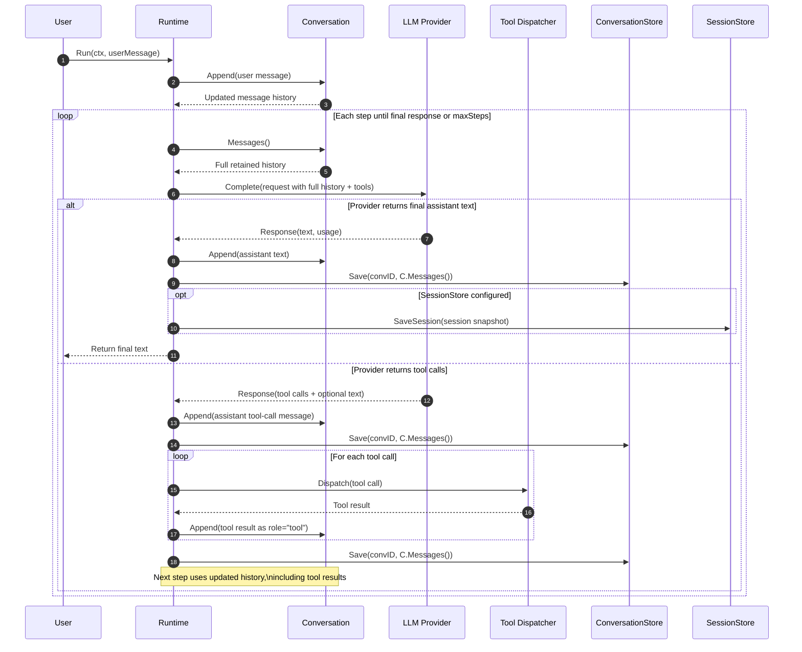
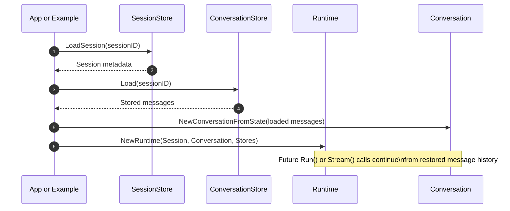

# Agent Memory Sequence

This file documents how conversational memory works in this SDK during `Run()` and how resume works.

## Runtime Memory Flow for a Single `Run()` Call

The runtime keeps memory in an in-memory `agent.Conversation`. When `Run()` starts, it appends the new user message to that conversation. For each step, it reads the full current retained message list from the conversation and sends that list to the LLM, so the model sees the entire current conversation buffer rather than only the latest turn.

If the model returns a final assistant response, the runtime appends that assistant message to the conversation, checkpoints the full retained conversation to the configured `ConversationStore`, saves session metadata to `SessionStore` if one exists, and returns the final text. If the model returns tool calls, the runtime appends the assistant tool-call message, checkpoints the conversation, dispatches the tools, appends each tool result as a `role="tool"` message, checkpoints again, and then starts the next step with that updated history.

This means memory is incremental in RAM but full-context on each LLM call: new messages are appended one by one, while each model request receives the full current retained history. The retained history may still be trimmed by the conversation strategy, so what gets sent is the entire current buffer after trimming, not necessarily the entire lifetime history.

## Run Sequence

## Resume Sequence

